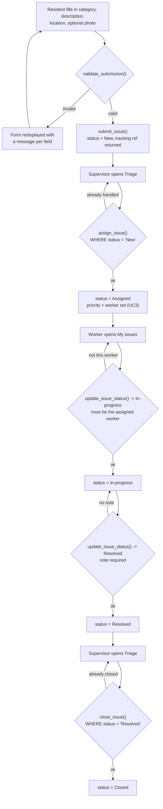
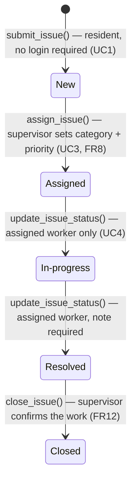
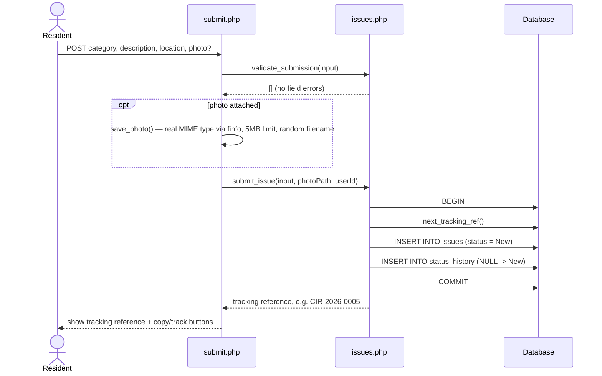

# Community Issue Reporting System

**CSCI 841 — Advanced Software Engineering · Group 2**

A web application where residents report local problems (streetlights, roads, water, waste) with a
category, location and optional photo; office staff triage and assign them; field staff resolve them;
and a supervisor monitors everything on a dashboard.

- **Imaginary client (course requirement):** the public-works office of a city / commune — *the Office*.
- **Project home page:** https://oudomthach2000.github.io/group-2-software-engineering/
- **Proposal (living Google Doc):** https://docs.google.com/document/d/1rLSzS4BTaCEJ3jATr-zUR9lfRH-AW2YI12V8GX5O3TU/edit

## Tech stack

- **PHP** — server-side (plain PHP, no framework, for clarity)
- **MySQL** — relational database
- **HTML / CSS / vanilla JavaScript** — front end
- Runs locally with **XAMPP** (Apache + PHP + MySQL), or any PHP + MySQL setup.

> GitHub stores the source code and serves the static home page (GitHub Pages). The working app is
> **dynamic** (PHP + database), so it runs on a local server — it is not "hosted" on GitHub itself.

## Repository structure

```
group-2-software-engineering/
├── index.html                  # Project home page (served by GitHub Pages)
├── README.md
├── .gitignore
├── db/
│   ├── schema.sql              # MySQL schema — 6 tables            (Pichponleur)
│   ├── seed.sql                # Sample categories + issues
│   └── migrations/
│       └── 001_add_issue_priority.sql  # FR8 priority; already in schema.sql, only for older databases (Oudom)
├── app/
│   ├── config.example.php      # Copy to app/config.php (gitignored) and set DB credentials
│   ├── includes/
│   │   ├── db.php              # PDO database connection            (Pichponleur)
│   │   ├── auth.php            # Sessions & role checks             (Sethouday)
│   │   ├── header.php          # Shared page header / nav           (Sethouday)
│   │   └── footer.php          # Shared page footer                 (Sethouday)
│   ├── src/
│   │   ├── issues.php          # UC1/UC3/UC4 lifecycle rules        (Oudom)
│   │   ├── notify.php          # UC7 notification service           (Rolando)
│   │   └── dashboard.php       # UC5 dashboard queries              (Pichponleur)
│   └── public/                 # <-- web root: point Apache/PHP here
│       ├── index.php           # App home                           (Pichponleur)
│       ├── submit.php          # UC1 Submit issue                   (Oudom)
│       ├── track.php           # UC2 Track issue                    (Sethouday)
│       ├── login.php           # UC6 Log in                         (Sethouday)
│       ├── register.php        # UC6 Register                       (Sethouday)
│       ├── logout.php          # UC6 Log out                        (Sethouday)
│       ├── staff/
│       │   └── issues.php      # UC4 Update / resolve               (Oudom)
│       ├── supervisor/
│       │   ├── triage.php      # UC3 Triage & assign                (Oudom)
│       │   └── dashboard.php   # UC5 Dashboard                      (Pichponleur)
│       ├── uploads/            # runtime photo uploads (gitignored)
│       └── assets/
│           ├── css/style.css   # Base styles                        (Sethouday)
│           ├── css/dashboard.css # UC5 dashboard styles             (Pichponleur)
│           └── js/app.js       # Front-end behaviour                (Sethouday)
├── scripts/
│   └── send_notifications.php  # UC7 delivers queued notifications  (Rolando)
├── tests/
│   ├── dashboard_test.php      # UC5 query tests (run with php)     (Pichponleur)
│   ├── issues_test.php         # UC1/UC3/UC4 lifecycle test         (Oudom)
│   ├── notify_test.php         # UC7 notification test              (Rolando)
│   ├── auth_test.php           # UC6 login & registration test      (Sethouday)
│   └── run_tests.php           # Runs every *_test.php, one result  (Rolando)
└── docs/
    ├── use-case-diagram.png
    └── system-sequence-uc1.png
```

## Use cases → where the code lives

| Use case | File | Owner |
|---|---|---|
| UC1 Submit issue        | `app/public/submit.php` → `submit_issue()` in `app/src/issues.php`        | Oudom |
| UC2 Track issue         | `app/public/track.php`                | Sethouday |
| UC3 Triage & assign     | `app/public/supervisor/triage.php` → `assign_issue()`                     | Oudom |
| UC4 Update / resolve    | `app/public/staff/issues.php` → `update_issue_status()`                   | Oudom |
| Close a resolved issue  | `app/public/supervisor/triage.php` → `close_issue()`                      | Oudom |
| UC5 Dashboard           | `app/public/supervisor/dashboard.php` | Pichponleur |
| UC6 Register / log in   | `app/public/login.php`, `register.php`| Sethouday |
| UC7 Notify resident     | `app/src/notify.php`                  | Rolando |

## Local setup (XAMPP)

1. Install **XAMPP** (bundles Apache + PHP + MySQL) and start **Apache** and **MySQL**.
2. Clone this repo, then point the site at the **`app/public`** folder (either copy the project into
   `htdocs`, or set an Apache virtual host with document root `.../app/public`).
3. Create the database and load the schema (phpMyAdmin, or the MySQL client):
   ```sql
   CREATE DATABASE community_issues CHARACTER SET utf8mb4 COLLATE utf8mb4_unicode_ci;
   USE community_issues;
   SOURCE db/schema.sql;
   SOURCE db/seed.sql;   -- optional sample data
   ```
4. Copy `app/config.example.php` to `app/config.php` and set your DB user/password.
5. Open the site (e.g. `http://localhost/`). Report and track pages work without an account; staff and
   supervisor pages require logging in. To make a supervisor: register an account, then
   `UPDATE users SET role='supervisor' WHERE email='you@example.com';`.

## Tests

Plain PHP scripts, no framework. Run them from the project root against a freshly imported
`db/schema.sql` + `db/seed.sql` (they expect exactly the sample data):

```
php tests/dashboard_test.php      # UC5: status counts, category counts, average resolution time
php tests/issues_test.php         # UC1/UC3/UC4: submit, triage, start, resolve, close, audit trail
php tests/notify_test.php         # UC7: recipient, channel, wording, delivery, failures, retry
php tests/auth_test.php           # UC6: registration rules, password hashing, login, role landing pages
php tests/run_tests.php           # all of the above, each in its own process, one overall result
```

Each check prints `PASS` or `FAIL`; the script exits with code 1 if any check fails.
`issues_test.php`, `notify_test.php` and `auth_test.php` run inside a transaction that is rolled back, so they leave the data unchanged.

## Try the issue flow and notifications (UC1, UC3, UC4, UC7)

The web root must be `app/public`, because every link in the pages starts with `/` (for example `/submit.php`).
The quickest way to serve it, from the project root:

```
php -S localhost:8000 -t app/public
```

PHP needs the `pdo_mysql`, `mbstring` and `fileinfo` extensions. To accept photos up to the 5 MB the form
promises, set `upload_max_filesize = 5M` in `php.ini`.

1. **Submit (UC1):** open `http://localhost:8000/submit.php`, fill in the form and put an email address or phone
   number in *Contact for updates*, otherwise no notification can be queued. Keep the tracking reference shown
   (for example `CIR-2026-0005`).
2. **Triage (UC3):** log in as `supervisor@example.com` (demo account from `db/seed.sql`), open *Triage*, choose a
   category and a priority (Low, Medium, High, Urgent), assign the issue to *Demo Field Staff*.
3. **Start and resolve (UC4):** log in as `staff@example.com`, open *My issues*, press *Start work*, then
   *Mark as resolved* with a note (a note is required to resolve).
4. **Close:** log in as the supervisor again and close the issue under *Resolved, waiting to be closed*.
5. **Notifications (UC7):** each status change after submission (Assigned, In-progress, Resolved, Closed) queues one
   row in the `notifications` table for a report that has a contact. Deliver them with:

   ```
   php scripts/send_notifications.php                  # Version 1 writes each message to app/logs/notifications.log
   php scripts/send_notifications.php --retry-failed   # put failed messages back in the queue first
   ```

Clicking through the flow adds issues, so `dashboard_test.php` (which expects exactly the sample data) will fail
until `db/schema.sql` and `db/seed.sql` are imported again.

## Issue lifecycle (UC1, UC3, UC4, close)

`app/src/issues.php` is the single place the lifecycle rules live: one function per transition
(`submit_issue()`, `assign_issue()`, `update_issue_status()`, `close_issue()`), each a conditional
`UPDATE ... WHERE status = <expected>`. A transition only succeeds while the issue is still in the status the
caller expects — optimistic concurrency, Section 7.2 — so when two staff act on the same issue at once, only
the first write succeeds and the second gets `false` back instead of silently overwriting it. Every successful
transition also appends one row to `status_history` in the same database transaction, which is the audit trail
(FR9). `tests/issues_test.php` checks both the happy path and every refused move (a second assignment, the
wrong worker, skipping a step, resolving without a note, closing twice).

### Process flow

Who does what, and what happens when a move is refused:



### Lifecycle states



### Sequence — UC1 Submit Issue

What actually happens inside one request, from the form post to the tracking reference:



## How we work together (contributions)

The professor tracks each member's contribution from **GitHub history**, so:

- **Each member implements their own files** (see the ownership column) and **commits under their own
  GitHub identity** — please don't have one person commit everyone's work.
- Set your identity once: `git config user.name "Your Name"` and `git config user.email "the-email-on-your-github"`.
- Make **small, frequent commits** with clear messages, e.g. `UC1: add submit form validation and insert`.
- Pull before you start, push when a piece works.

## Course versions

Proposal v1 (SWEBOK Ch.1 Requirements) and v2 (Ch.7 Software Engineering Management) are in the living
Google Doc. First demo with **Version 1 code** is around **Oct 11** — target a working slice:
submit → triage → assign → resolve.

## Status

Initial project skeleton. Every use case has a stub file with a `TODO` describing exactly what to build.
